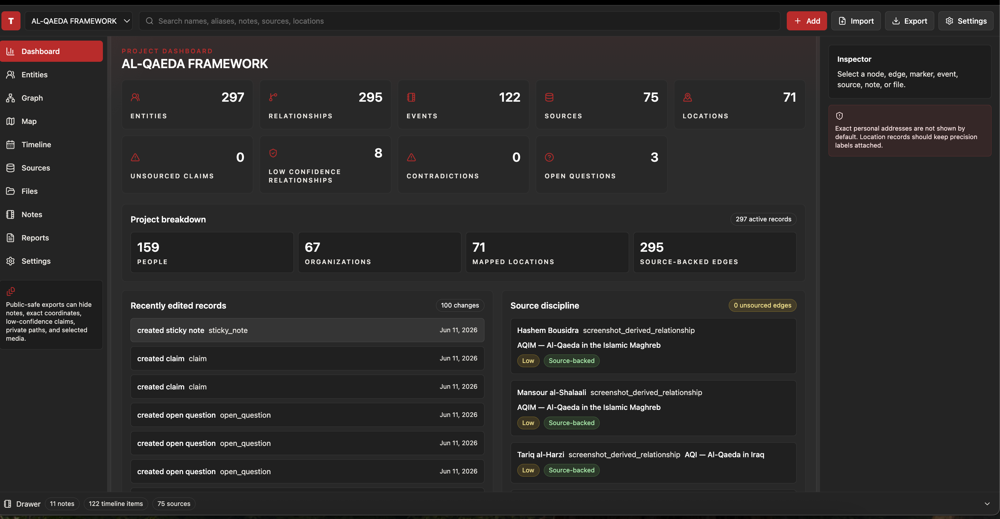
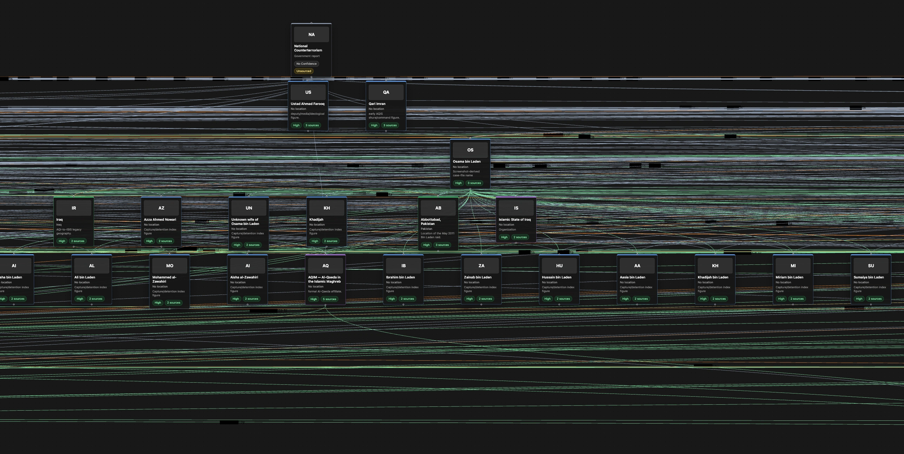
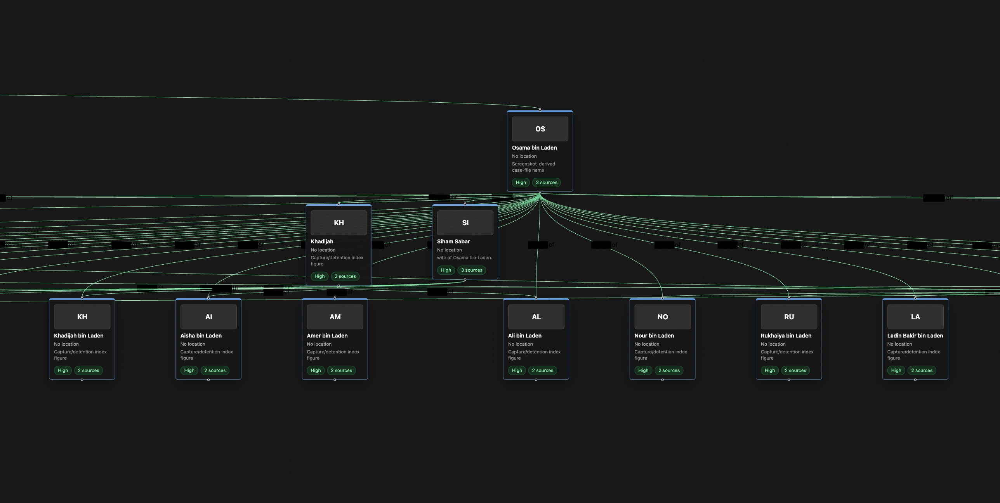
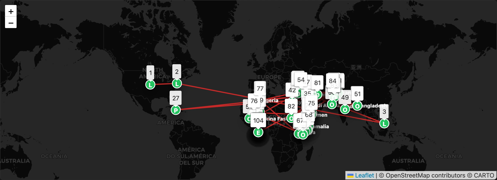
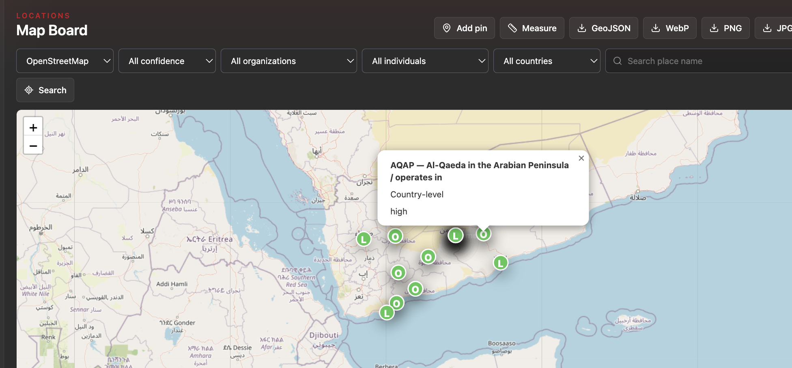
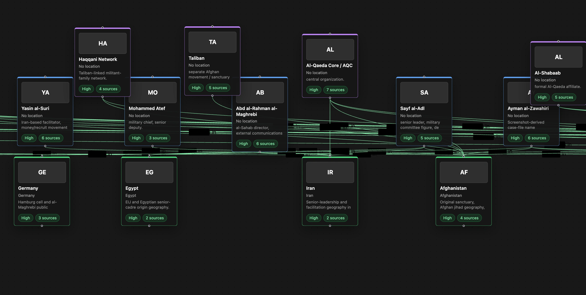
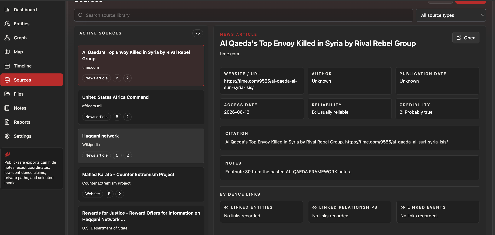
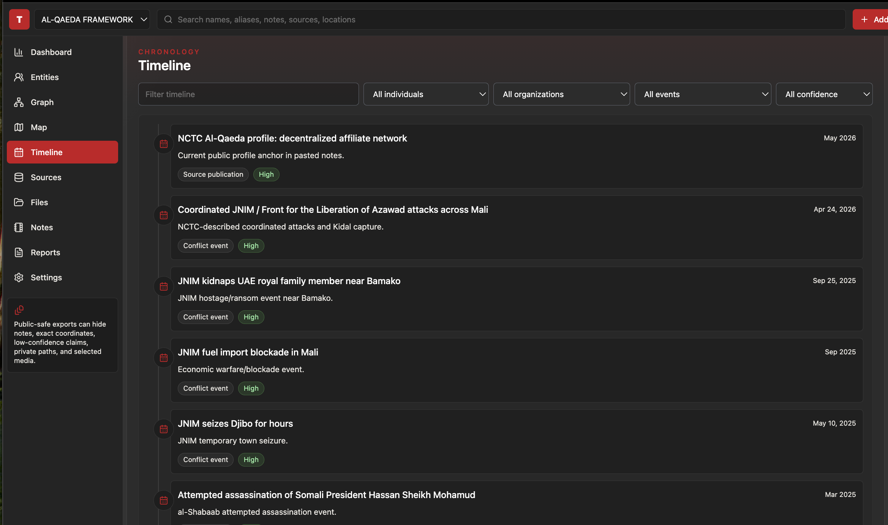

# SIGNALIS

**SIGNALIS** is a local-first open-source intelligence platform I created for studying, organizing, and visualizing public-source research on topics I enjoy: terrorism networks, geopolitical organizations, insurgent movements, proxy groups, sanctions ecosystems, historical conflict networks, and other large-scale security subjects.

It is built as a manual analyst workspace. Instead of keeping research scattered across notes, screenshots, spreadsheets, browser tabs, maps, PDFs, and timelines, SIGNALIS lets a project become one connected research environment:

```text
People → Organizations → Events → Sources → Locations → Claims → Notes → Timelines → Graphs → Maps
```

The current seeded project is the **Al-Qaeda Framework**, but SIGNALIS is designed to support future research modules for large organizations and networks such as **Hamas**, **Hezbollah**, **ISIS**, **Wagner**, and other terrorism, insurgency, militia, proxy, sanctions, and geopolitical influence networks.

SIGNALIS is not a surveillance tool. It does not perform live tracking, private-account scraping, doxxing automation, AI targeting, credential scraping, or automatic sensitive-data inference. It is intended for lawful public-source research, historical study, sanctions research, academic-style analysis, and structured manual evidence review.

---

## Current Seed Project: Al-Qaeda Framework

The first built-in framework is the **Al-Qaeda Framework**, a structured public-source network model covering Al-Qaeda Core, major affiliates, historical branches, leadership networks, family structures, timeline events, source records, mapped locations, and confidence-labeled relationships.

The seeded framework includes:

* Al-Qaeda Core / AQC
* AQAP — Al-Qaeda in the Arabian Peninsula
* AQIM — Al-Qaeda in the Islamic Maghreb
* JNIM — Jama’at Nusrat al-Islam wal-Muslimin
* al-Shabaab
* AQIS — Al-Qaeda in the Indian Subcontinent
* Hurras al-Din and the Syria/Nusra/HTS lineage
* AQI as a historical legacy branch
* Taliban and Haqqani Network as contextual sanctuary/alliance networks
* Iran-based senior leadership and facilitation nodes
* Family, succession, command, media, geography, and source-confidence relationships

Current seeded framework size:

```text
297 entities
295 relationships
122 events
75 sources
71 locations
8 low-confidence / chart-derived / screenshot-derived relationships
0 unsourced claims
3 open questions
```

This is only the first framework. The larger goal is for SIGNALIS to become a reusable research platform where each investigation or organization can become its own structured project.

Feel free to delete the initial project, it's just what I was actively working on for a research paper. You can add whatever personalized project you are working on and multiple, it stores locally for now but will eventually be implemented into an encrypted localized platform similiar to Obsidian. 

---

## Interface Preview

The screenshots below show the current Al-Qaeda Framework running inside SIGNALIS. The same interface can be reused for future frameworks and research projects.

### Dashboard Overview

The dashboard gives a high-level view of the active project: entities, relationships, events, sources, mapped locations, low-confidence relationships, recent edits, open questions, and source-discipline checks.

<p align="center">
  
</p>

---

### Full Network Graph

The graph board visualizes large relationship networks. It supports different layouts, record filters, organization filters, country filters, graph exports, and dense network exploration.

<p align="center">
  
</p>

---

### Family / Succession View

The family-tree layout is useful for studying kinship, succession, symbolic legitimacy, leadership families, and marriage-connected network structures.

<p align="center">
  
</p>

---

### Global Map Board

The map board displays broad geographic patterns, operating areas, event locations, organization geography, reported locations, and region-level or country-level mapping.

<p align="center">
  
</p>

---

### Regional Map Detail

Regional views make it easier to focus on a specific operating environment, such as Yemen, Somalia, the Sahel, Afghanistan/Pakistan, Syria, North Africa, or any other research theater.

<p align="center">
  
</p>

---

### Location Intelligence View

Location records can be tagged by precision, confidence, organization, individual, country, and source relationship. Exact personal addresses are not shown by default.

<p align="center">
  
</p>

---

### Source Review Workspace

The source workspace stores citations, source type, publisher, reliability, credibility, access dates, source notes, and evidence links to entities, relationships, and events.

<p align="center">
  
</p>

---

### Timeline View

The timeline combines historical events, leadership changes, deaths, captures, designations, sanctions, source publication dates, relationship changes, reported-location events, and open questions.

<p align="center">
  
</p>

---

## Why I Built SIGNALIS

I wanted a research tool that felt closer to an analyst notebook than a generic notes app.

Most tools let you write notes. SIGNALIS lets you structure them.

The goal is to make public-source research easier to understand visually, historically, and relationally. Instead of treating every source, person, organization, event, and location as separate information, SIGNALIS lets them become part of one connected workspace.

It is designed for people who enjoy deep research, visual mapping, historical timelines, geopolitical networks, sanctions analysis, organizational structures, and source-backed investigation.

---

## Main Features

### Multi-Project Workspace

SIGNALIS supports multiple local research projects. Each project can represent a different organization, conflict theater, network, case file, or investigation.

Example future projects:

```text
Al-Qaeda Framework
Hamas Network Framework
Hezbollah Network Framework
ISIS / Islamic State Framework
Wagner Network Framework
Taliban / Haqqani Framework
Iran Proxy Network Framework
Sahel Insurgency Framework
Transnational Sanctions Network
```

---

### Structured Entity Database

SIGNALIS supports structured records for:

* People
* Organizations
* Locations
* Events
* Sources
* Claims
* Open questions
* Notes
* Files
* Relationships
* Graph layouts
* Map markers
* Sticky notes

Each record can be linked to other records, giving the research project a reusable structure instead of isolated notes.

---

### Relationship Mapping

Relationships can represent:

* Founder of
* Leader of
* Member of
* Affiliate of
* Predecessor of
* Successor of
* Merged into
* Split from
* Pledged allegiance to
* Claimed attack
* Designated by
* Wanted by
* Sanctioned by
* Family member of
* Married to
* Son of
* Son-in-law of
* Mentor of
* Ideological influence on
* Sanctuary provider for
* Operates in
* Based in
* Reported location
* Chart-derived relationship
* Screenshot-derived relationship
* Contested relationship
* Needs corroboration

Relationships support source and confidence labeling so weak, chart-only, screenshot-derived, or contested links do not appear as fully verified claims.

---

### Graph Board

The graph board uses React Flow to visualize relationship networks.

Supported graph modes include:

* Freeform
* Spider diagram
* Hierarchy
* Family tree
* Organization chart
* Event network
* Location network
* Source/evidence graph

Graph features include:

* Custom entity nodes
* Sticky notes
* Labeled edges
* Drag-to-create relationships
* Layout controls
* Organization filters
* Country filters
* Record filters
* Zoom and pan
* Dark minimap
* JPG, WebP, PNG, and SVG export

---

### Map Board

The map board uses Leaflet for geographic analysis.

It supports:

* Broad operating-area mapping
* Event location mapping
* Organization geography
* Individual location records
* Country and region-level mapping
* Confidence filters
* Organization filters
* Individual filters
* Country filters
* Measurement tools
* Manual geocoding
* GeoJSON export
* PNG, JPG, and WebP capture

Location records should include precision labels such as:

```text
country-level
region-level
city-level
approximate
historical
reported
unknown
```

Exact personal addresses are not displayed by default.

---

### Timeline

The timeline view combines:

* Major events
* Deaths
* Captures
* Arrests
* Leadership changes
* Sanctions
* Designations
* Relationship changes
* Source publication dates
* Reported-location events
* Open questions

Some events use exact dates. Others can be marked as approximate, month-level, year-level, reported, or contested.

---

### Source Workspace

The source system tracks:

* Title
* Publisher
* Source type
* URL
* Author
* Publication date
* Access date
* Reliability
* Credibility
* Citation text
* Notes
* Linked entities
* Linked relationships
* Linked events

This helps separate confirmed public-source information from chart-derived, screenshot-derived, contested, or low-confidence claims.

---

### Notes and Reports

SIGNALIS includes a notes workspace and report/export workflows for turning structured research into readable dossiers.

Current export formats include:

* Markdown
* HTML
* JSON
* ZIP archive
* GeoJSON
* GraphML
* CSV

---

## Quick Start

### Requirements

* Node.js 22.5 or newer
* npm

SIGNALIS currently runs best on Node 22.

Check your Node version:

```bash
node -v
```

Expected:

```text
v22.x.x
```

---

### Install Dependencies

```bash
npm install --cache .npm-cache
```

---

### Reset and Seed the Database

```bash
npm run db:reset
```

This removes the local SQLite database, recreates the schema, and reloads the seeded framework.

---

### Run the App

```bash
npm run dev
```

This starts both the backend and the frontend.

The backend API usually runs at:

```text
http://localhost:4343/
```

The frontend usually runs at:

```text
http://localhost:5173/
```

or:

```text
http://localhost:5174/
```

Use the Vite URL printed in the terminal.

---

## Development Workflow

From the project root:

```bash
npm run dev
```

This runs:

```text
SERVER: node server/index.mjs
CLIENT: vite --host 0.0.0.0
```

To stop the app, press:

```text
Control + C
```

To kill common local dev ports:

```bash
lsof -ti :4343 | xargs kill -9 2>/dev/null
lsof -ti :5173 | xargs kill -9 2>/dev/null
lsof -ti :5174 | xargs kill -9 2>/dev/null
```

Then restart:

```bash
npm run dev
```

---

## Production Local Use

Build the frontend:

```bash
npm run build
```

Preview the production build:

```bash
npm run preview
```

If your local package includes a production server script, you can also run:

```bash
npm run start
```

Open the URL printed in the terminal.

---

## Project Structure

```text
.
├── server/
│   ├── db.mjs                  # SQLite schema, data access, exports
│   ├── index.mjs               # Express API and static production server
│   ├── seedData.mjs            # First-launch framework seed data
│   └── scripts/
│       ├── reset-db.mjs
│       └── seed.mjs
├── src/
│   ├── components/             # Layout, inspector, quick add, UI primitives
│   ├── lib/                    # API and download helpers
│   ├── store/                  # Zustand workspace store
│   ├── views/                  # Dashboard, graph, map, timeline, sources, files, notes, reports
│   ├── constants.ts
│   ├── styles.css
│   └── types.ts
├── data/                       # Local SQLite database
├── media/
│   └── documents/
│       └── images/             # README screenshots
├── exports/                    # Export output and verification artifacts
├── backups/                    # Local project/database backups
└── dist/                       # Production frontend build
```

---

## Database Reset

To fully reset and reseed the local database:

```bash
npm run db:reset
```

The current database file is:

```text
data/taosint.sqlite
```

The public-facing application is now branded as SIGNALIS, but some internal filenames may still use the original development name.

To manually force a clean reseed:

```bash
rm data/taosint.sqlite
npm run dev
```

---

## Local Storage

SIGNALIS keeps project data on the local machine:

```text
data/taosint.sqlite
media/images/
media/documents/
media/originals/
media/processed/
exports/
backups/
```

Data is not automatically uploaded to a remote server.

---

## Import and Export

Project exports:

```text
/api/projects/:projectId/export/json
/api/projects/:projectId/export/zip
/api/projects/:projectId/export/geojson
/api/projects/:projectId/export/graphml
/api/projects/:projectId/export/markdown
/api/projects/:projectId/export/csv/entities
/api/projects/:projectId/export/csv/relationships
/api/projects/:projectId/export/csv/events
/api/projects/:projectId/export/csv/sources
```

Entity dossier export:

```text
/api/entities/:id/export/markdown
```

Project JSON import:

```text
POST /api/projects/import/json
```

Graph exports:

```text
JPG
WebP
PNG
SVG
```

Map exports:

```text
GeoJSON
PNG
JPG
WebP
```

---

## Safety Constraints

SIGNALIS is built for lawful public-source research and structured analysis.

Design constraints:

* No live tracking
* No automated doxxing
* No private-account scraping
* No automatic sensitive personal-data inference
* No embedded targeting workflow
* No credential scraping
* Exact personal addresses are not displayed by default
* Location precision labels are attached to mapped records
* Relationships and claims show source/confidence status
* Unsourced and low-confidence records are visibly marked
* Chart-derived claims remain labeled
* Screenshot-derived claims remain labeled
* Public-safe export modes are prioritized

---

## Source Confidence Model

SIGNALIS supports confidence labels such as:

```text
Official / high confidence
Research / high confidence
Public reported
Chart-derived
Screenshot-derived
Low confidence
Contested
Needs corroboration
Unknown
```

This is important because not every relationship has the same evidentiary weight.

Example:

```text
Osama bin Laden → founder of → Al-Qaeda
```

is a high-confidence historical relationship.

But:

```text
Screenshot-derived individual → linked to → case layer
```

should stay low-confidence or needs-corroboration until independently verified.

---

## Future Research Modules

SIGNALIS is designed to support future structured frameworks such as:

* Hamas
* Hezbollah
* ISIS / Islamic State
* Wagner Group
* Taliban / Haqqani Network
* Iran proxy networks
* Sahel insurgency networks
* Transnational sanctions networks
* Organized crime and conflict-finance networks
* Geopolitical influence and proxy ecosystems

Each framework can have its own entities, relationships, sources, locations, events, claims, notes, graph layouts, maps, and reports.

---

## Future Updates

SIGNALIS is being developed as a broader public-source intelligence platform, not just a static research notebook. Future updates will add modular intelligence components for archive search, source collection, watchlists, sanctions monitoring, signal filtering, and automated briefing support.

### Semantic Archive

A searchable intelligence memory for events, entities, notes, source records, claims, aliases, locations, and relationship history.

The goal is to make every record in SIGNALIS reusable across future investigations, allowing the analyst to search not only by exact names, but also by themes, actors, regions, organizations, event types, and historical patterns.

---

### Daily Briefing Generator

An AI-shaped briefing system for turning events, notes, watchlists, entity updates, and source records into daily intelligence-style summaries.

Planned briefing outputs include:

* Daily project brief
* Watchlist updates
* New source summary
* Entity-change digest
* Sanctions-change digest
* Timeline activity summary
* Analyst-priority queue

---

### Noise Filtering Engine

A filtering layer designed to reduce low-value information before analyst review.

The goal is to help separate strategic signals from repetitive, duplicate, irrelevant, stale, or low-confidence material. This would support cleaner source review, better watchlists, and more focused daily briefs.

---

### OFAC / Sanctions Monitor

A sanctions-tracking component for entities, aliases, programs, countries, identifiers, designations, delistings, and related metadata.

Planned use cases include:

* OFAC entity monitoring
* Sanctions-program tracking
* Alias and identifier matching
* Country and program filtering
* Designation timeline history
* Entity-to-sanction relationship mapping
* Exportable sanctions research notes

---

### Watchlist Engine

A topic-based monitoring system for regions, actors, threats, sanctions, organizations, and emerging events.

Watchlists will help analysts track specific subjects such as:

* Named organizations
* Specific leaders
* Countries or regions
* Sanctions programs
* Terrorism designations
* Conflict zones
* Proxy networks
* Emerging event clusters

---

### Collector Orchestration

A controlled ingestion engine for eligible public-source collection.

The collector orchestration layer will rotate approved sources, route each source to the correct collector, apply cooldowns, normalize public-source records, and store collected data for downstream analysis.

It is designed to support scalable collection from sources such as:

* RSS feeds
* GDELT
* OFAC data
* Sanctions lists
* Public advisories
* Government reports
* Think-tank publications
* Future approved source modules

The purpose is controlled collection — not uncontrolled scraping, API hammering, or duplicate ingestion.

---

### Source Registry

A governed source-management layer for approved public-source collection.

The Source Registry will track:

* Source name
* Source type
* Reliability
* Collection method
* Cooldown period
* Last checked date
* API limits
* Duplicate risk
* Allowed collector
* Notes and restrictions

This will help keep future collection workflows disciplined, auditable, and respectful of source limits.

---

## Long-Term Direction

The long-term goal is for SIGNALIS to become a modular intelligence research system where manual analysis, structured data, source review, graph mapping, timeline building, sanctions monitoring, watchlists, controlled public-source collection, and briefing generation all work together inside one local-first platform.

---

## Roadmap

Planned improvements:

* Richer entity profile pages
* Full claim/evidence editor
* Better date-precision display
* Redaction-aware public viewer export
* Graph clustering for dense networks
* Map marker clustering
* Map drawing tools for polygons and routes
* Full local image derivative editor
* OCR with searchable text
* PDF report generation
* Optional Tauri desktop wrapper
* Optional offline map/geocoder support
* Additional seeded frameworks for Hamas, Hezbollah, ISIS, Wagner, and other large networks

---

## License / Use
MIT License

Copyright (c) 2026 Tobin Albanese

Permission is hereby granted, free of charge, to any person obtaining a copy
of this software and associated documentation files (the "Software"), to deal
in the Software without restriction, including without limitation the rights
to use, copy, modify, merge, publish, distribute, sublicense, and/or sell
copies of the Software, and to permit persons to whom the Software is
furnished to do so, subject to the following conditions:

The above copyright notice and this permission notice shall be included in all
copies or substantial portions of the Software.

THE SOFTWARE IS PROVIDED "AS IS", WITHOUT WARRANTY OF ANY KIND, EXPRESS OR
IMPLIED, INCLUDING BUT NOT LIMITED TO THE WARRANTIES OF MERCHANTABILITY,
FITNESS FOR A PARTICULAR PURPOSE AND NONINFRINGEMENT. IN NO EVENT SHALL THE
AUTHORS OR COPYRIGHT HOLDERS BE LIABLE FOR ANY CLAIM, DAMAGES OR OTHER
LIABILITY, WHETHER IN AN ACTION OF CONTRACT, TORT OR OTHERWISE, ARISING FROM,
OUT OF OR IN CONNECTION WITH THE SOFTWARE OR THE USE OR OTHER DEALINGS IN THE
SOFTWARE.

SIGNALIS is a local-first research tool for lawful public-source analysis and structured intelligence-style note management. Users are responsible for ensuring that their research, exports, and publication workflows comply with applicable laws, platform policies, and ethical standards.
